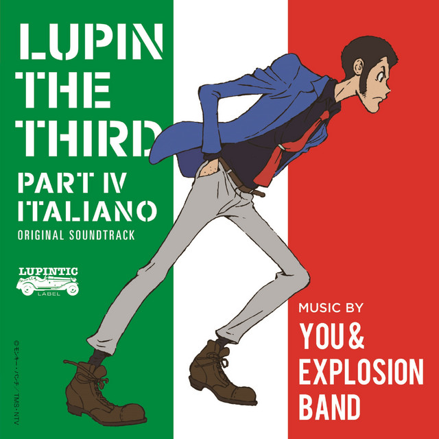
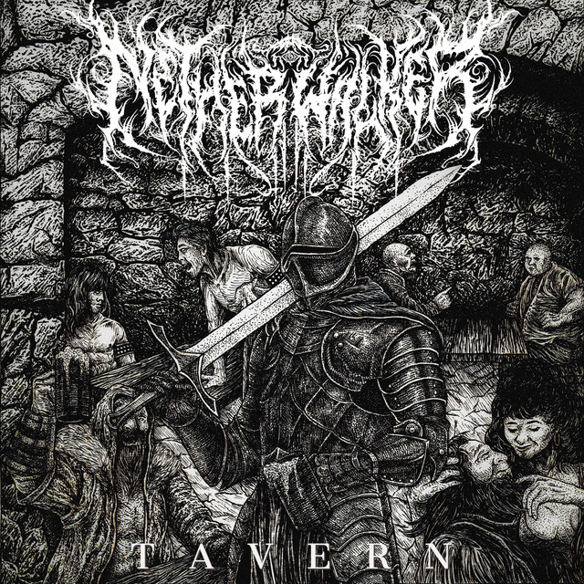
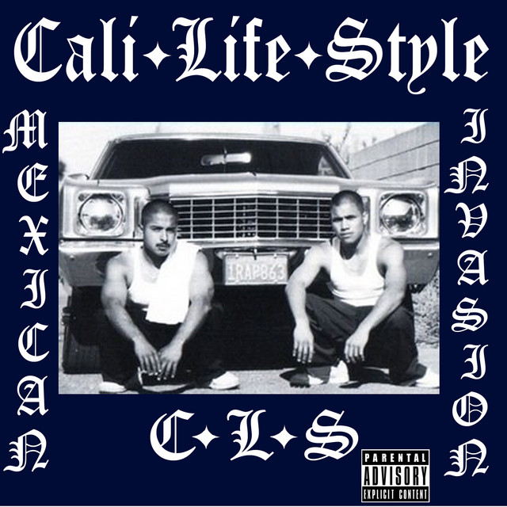
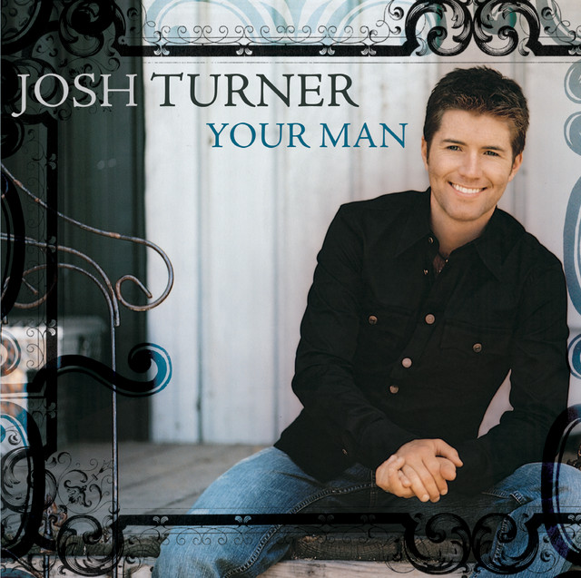

# Me in Markdown - 2026
## Letter to Mr. Aiello
Lorem ipsum dolor sit amet, consectetur adipiscing elit. Sed do eiusmod tempor incididunt ut labore et dolore magna aliqua. Ut enim ad minim veniam, quis nostrud exercitation ullamco laboris nisi ut aliquip ex ea commodo consequat. Duis aute irure dolor in reprehenderit in voluptate velit esse cillum dolore eu fugiat nulla pariatur. Excepteur sint occaecat cupidatat non proident, sunt in culpa qui officia deserunt mollit anim id est laborum.

Quis autem vel eum iure reprehenderit qui in ea voluptate velit esse quam nihil molestiae consequatur, vel illum qui dolorem eum fugiat quo voluptas nulla pariatur? At vero eos et accusamus et iusto odio dignissimos ducimus qui blanditiis praesentium voluptatum deleniti atque corrupti quos dolores et quas molestias excepturi sint occaecati cupiditate non provident, similique sunt in culpa qui officia deserunt mollitia animi, id est laborum et dolorum fuga.

Et harum quidem rerum facilis est et expedita distinctio. Nam libero tempore, cum soluta nobis est eligendi optio cumque nihil impedit quo minus id quod maxime placeat facere possimus, omnis voluptas assumenda est, omnis dolor repellendus. Temporibus autem quibusdam et aut officiis debitis aut rerum necessitatibus saepe eveniet ut et voluptates repudiandae sint et molestiae non recusandae. Itaque earum rerum hic tenetur a sapiente delectus.
## Recent Replays
As you could tell by my letter, music is something very important to me. As far as genres go, I don't care as long as I find the song good. I do mostly stay with Rock and Metal, but those aren't the only genres I like.

[Here is a playlist of my most recent repeats, and some past ones!](https://open.spotify.com/playlist/2BwHn4ATMn3DPE5GFr8xkC?si=KnZRbw7IRUWGA-WSVvAUaA)

For another example of my genre tastes, here's a table on 6 songs I like of different genres.

||Song Name|Genre|Rating (⭐️⭐️⭐️⭐️⭐️)|Explaination|
|-|-|-|-|-|
||<strong style="color:RGB(255,0,0)">**SAMBA**</strong> <strong style="color:RGB(255,255,255)">**TEMPERADO**</strong> <strong style="color:RGB(0,255,0)">**2015**</strong>  <strong style="color:RGB(120,120,120)">by Yuji Ohno</strong>|Latin Jazz|⭐️⭐️⭐️⭐️⭐️|Ever since I've heard this song I've been in love with it (mostly the trombone solo).
||<strong style="color:RGB(80,80,80)">**Tavern**</strong> <strong style="color:RGB(120,120,120)"> by Netherwalker </strong>|Deathcore|⭐️⭐️⭐️|While I like the song, the lyrics are unintelligible.
||<strong style="color:RGB(0, 42, 84)">**Lost**</strong> <strong style="color:RGB(120,120,120)"> by T-Dre, Delux, Cali Life Style</strong>|Rap|⭐️⭐️⭐️⭐️|Fell in love with this song after my dad played it in the car on a drive with my Tío.
||**Your Man** by Josh Turner|Country|⭐️⭐️⭐️|One of the few country songs I listen to (and like) because of my mom.
||<strong style="color:RGB(169, 169, 169)">**死ぬのがいいわ (Shinunoga E-Wa)**</strong> <strong style="color:RGB(120, 120, 120)">by Fujii Kaze </strong>|R&B|⭐️⭐️⭐️⭐️|I heard this song after it started getting popular online and just loved it.
||**Oops!...I Did It Again** by Britney Spears|Pop|⭐️⭐️⭐️⭐️⭐️|This is just a really good song. I don't think I need to explain why.

