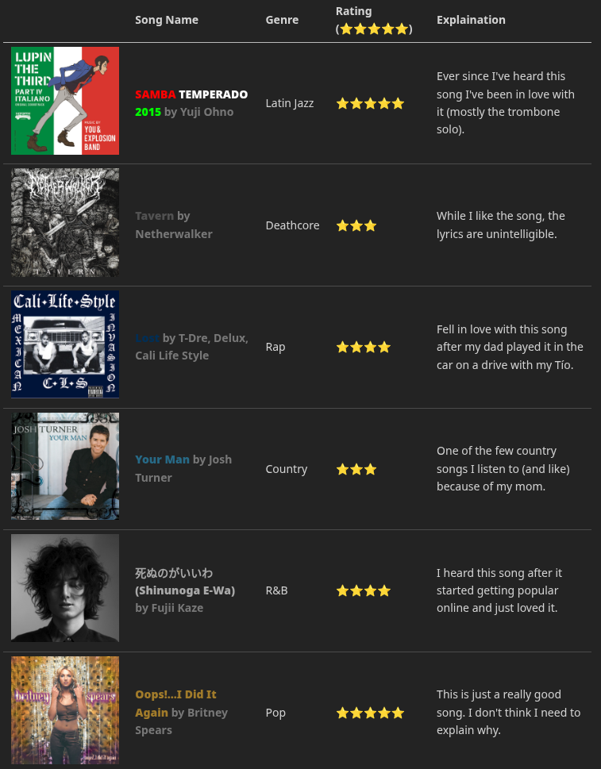

# Me in Markdown - 2026
## Letter to Mr. Aiello
Hello! My name is Andres Garibay, and I am starting my sophomore year. A few of my favorite things are the movie *The Lord of the Rings: The Fellowship of the Ring* and the book *The Shining*. My favorite part of school is band, whether it's learning new music or a new instrument. While I try to balance school and band, it can be hard sometimes. I do also try to make sure everyone has fun and understands what is going on in band and the class we are in at the time.

Over the summer, I have learned how to play the French horn and mellophone, while also learning how to read treble clef. Learning mellophone would also be my personal achievement, because I learned not only how to play it, but also how to play the show for the new marching season. A fun fact about me is that I play about 14 instruments.

4 of them are shown below:

Timpani:

Euphonium / Baritone:

Piano:

Trombone:

Outside of school, I do marching band, as I previously mentioned. I enjoy it a lot, and it’s mostly because of the competitions. Other things I enjoy are crocheting and writing music. I have been crocheting since 7th grade, and I started writing music last year. My best summer memory this year is the last day of band camp. The upperclassmen threw water balloons at us during the drill down, and it turned into a huge water-balloon fight. My main goals this year are to get straight A’s and get at least a 4 on all my AP tests. My other goal for this year is to become Drum Major for next year's season by the tryouts next semester. I mainly want to do this because I want to major in music and become a band director in the future. Band has taught me important lessons and helped me become a better student in school and a better leader when it comes to that.

[Here is a playlist of my most recent repeats, and some past ones!](https://open.spotify.com/playlist/2BwHn4ATMn3DPE5GFr8xkC?si=KnZRbw7IRUWGA-WSVvAUaA)

For another example of my genre tastes, here's a table on 6 songs I like of different genres.

